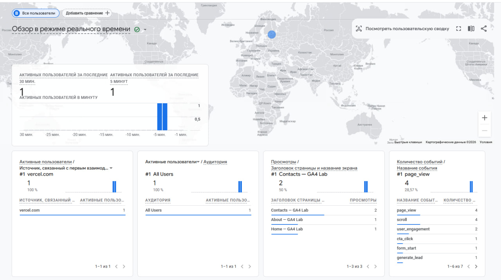
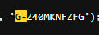
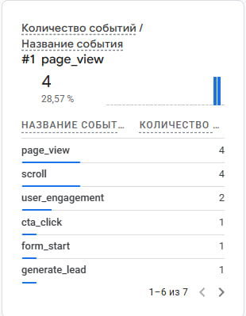
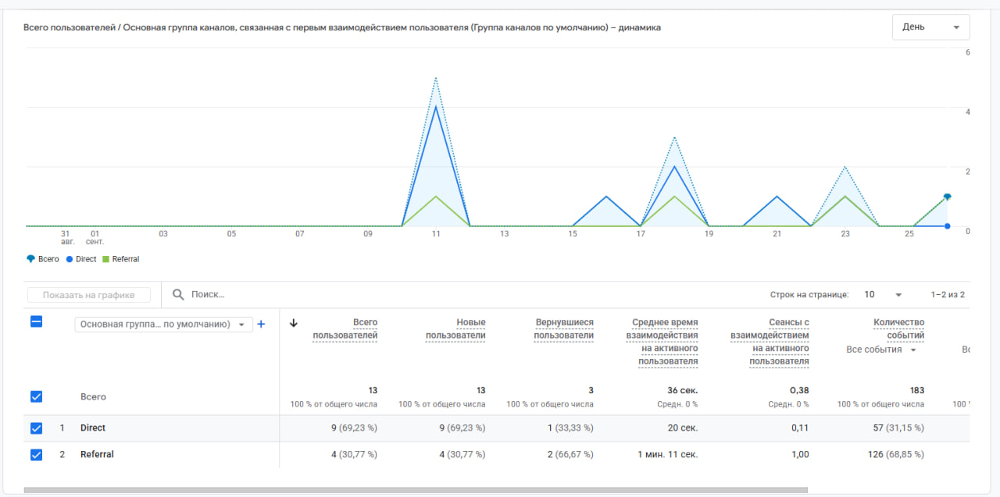
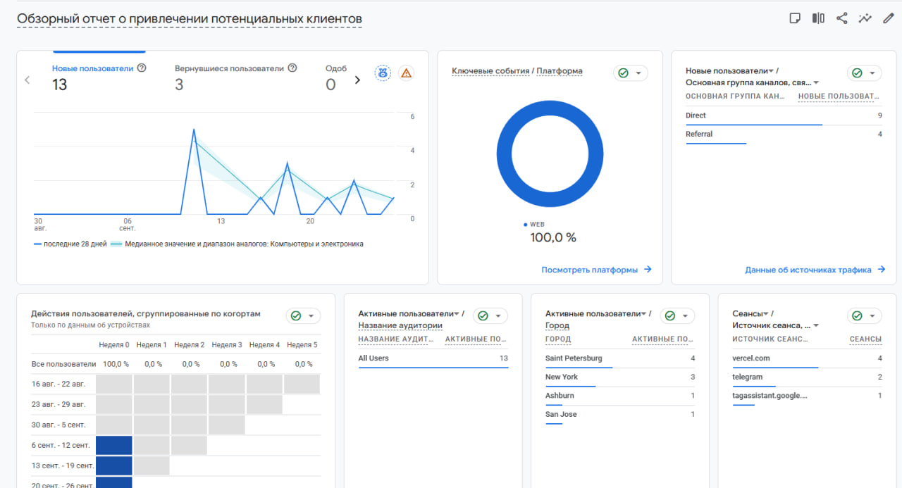

| № | Что доказываем | Где это видно |
|---|---|---|
| 1 | Google Tag установлен на сайт |  |
| 2 | Тег стоит в коде страницы |  |
| 3 | Аналитика получает события с сайта |  |
| 4 | Источник перехода определяется |  |
| 5 | На странице «Отчёты» есть статистика |  |