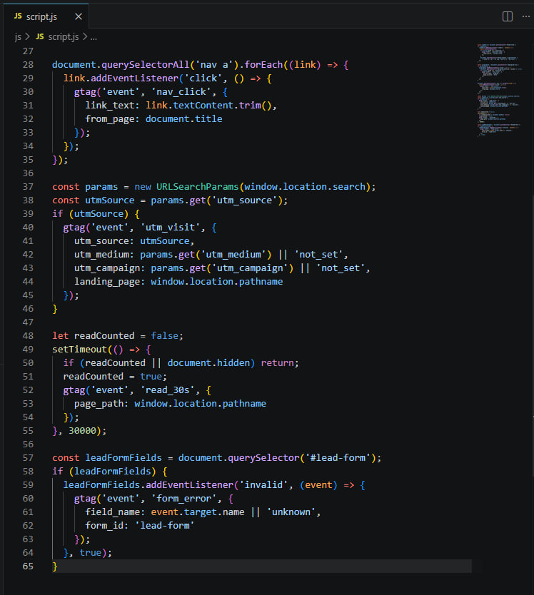
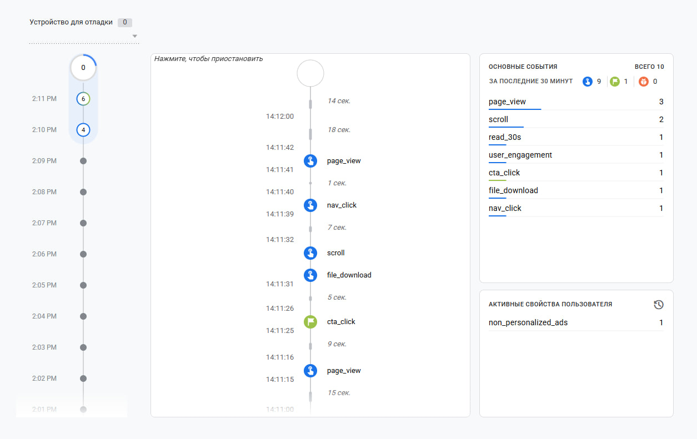
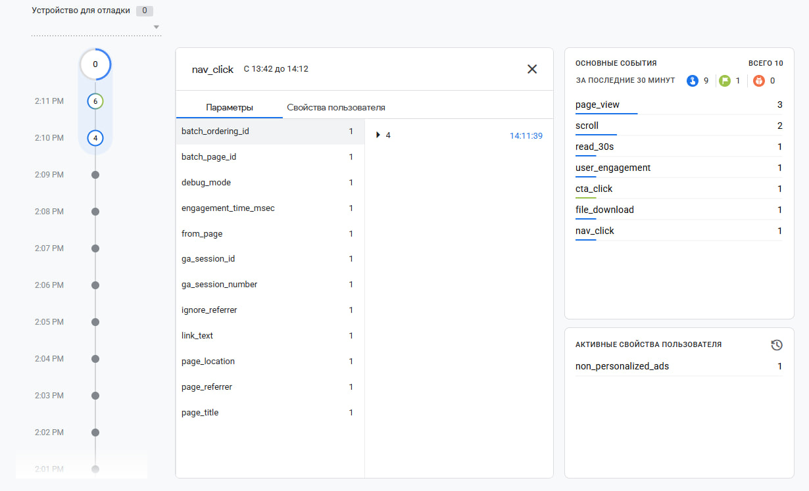
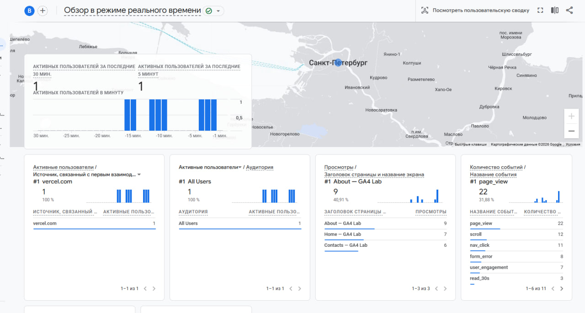

## Подтверждение реализации метрик

### 1. Метрики добавлены в проект
Скриншот конца файла `js/script.js` с блоками кода событий.

---

### 2. События доходят до аналитики (DebugView)
Скриншот ленты DebugView в GA4, где видны свежие события (`nav_click`, `utm_visit` и др.).

---

### 3. Параметры приходят вместе с событием
Скриншот раскрытой карточки события в DebugView. Видны кастомные параметры (`utm_source`, `link_text` и т.д.) в блоке Parameters.

---

### 4. Событие видно в отчетах (не только в отладке)
Скриншот из раздела GA4 «Отчеты → Взаимодействие → События» либо из вкладки «В реальном времени», подтверждающий накопление данных.

